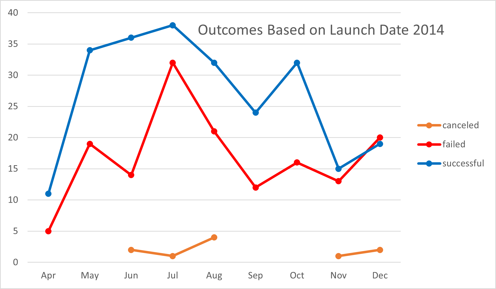

# Kickstarting with Excel

## Overview of Module 1 Challenge

### Purpose

The Purpose of this Analysis with Excel is to make a comparative analysis of fundraising goals amounts in relation to launch dates. Outcomes based on fundraising goals can be compared with outcomes based on launch date for a single or multiple groups of years 

## Analysis and Challenges

The challenge is that we are looking to launch a successful Kickstarter campaign by fundraising in the right month and at a realistic budget range that would promise a successful fundraiser for Louise. 

Analysis was done with Excel spreadsheet:  [Kickstarter_Challenge.xlsx](Kickstarter_Challenge.xlsx) 

### Analysis of Outcomes Based on Launch Date

Reviewing the first 5 years of Theater Kickstarter (2009-2013) netted only 26 fundraisers of which 26 were entirely successful for a 100% rate, which means skews the data all the way towards most Theater Kickstarters were fully funded easily, besting 50% of the median goal more than was asked.

| 2009-2013 Kickstarter      | Successful | Failed | cancelled | Successful dollar goal | Successful dollar pledge | difference |
| -------------------------- | ---------- | ------ | --------- | ---------------------- | ------------------------ | ---------- |
| Mean Goal                  | 4.7        |        |           | 5407.43                | 7583.47                  | 140%       |
| Median Goal                | 2          |        |           | 5250.00                | 8559.24                  | 163%       |
| Standard Deviation of Goal | 6.9        |        |           | 2255.07                | 3528.15                  | 156%       |
| Upper Quartile of Goal     | 4          |        |           | 7741.67                | 11643.67                 | 150%       |
| Lower Quartile of Goal     | 1          |        |           | 2850.00                | 2933.00                  | 103%       |
| IQR of Goal                | 3          |        |           | 4891.67                | 8710.67                  | 178%       |

However, we can note that fundraising is highest around April and drops down by August before rising again around November.

Looking at data alone for 2014 shows a wide Standard Deviation of 64.9, which doesn't give us data that is close enough to have a good idea on our fundraising potential. We can note the trend that in this year vs. Prior Years, the fundraising campaigns started to have a large increase after April and slowly tapered off after July with an end of year peak that went up in October.

| 2014 Kickstarter           | Successful | Failed | Cancelled | Successful dollar goal | Successful dollar pledge | Difference |
| -------------------------- | ---------- | ------ | --------- | ---------------------- | ------------------------ | ---------- |
| Mean Goal                  | 48.2       | 30.4   | 3.3       | 6816.72                | 7769.24                  | 114%       |
| Median Goal                | 32.0       | 17.5   | 2.0       | 5637.75                | 6395.83                  | 113%       |
| Standard Deviation of Goal | **64.9**   | 41.1   | 3.1       | 3521.83                | 4024.75                  | 114%       |
| Upper Quartile of Goal     | 36.5       | 23.8   | 5.5       | 10105.38               | 11780.98                 | 117%       |
| Lower Quartile of Goal     | 18.0       | 12.8   | 1.0       | 3884.77                | 4175.80                  | 107%       |
| IQR of Goal                | 18.5       | 11.0   | 4.5       | 6220.61                | 7605.18                  | 122%       |

Looking at the data where the sample size is much larger (than 26) from 2014 to 2016 and on gets numbers that are closer in line with the Mean and Median columns for each case.

| 2014-2017 Kickstarter      | Successful | Failed  | Cancelled | Successful dollar goal | Successful dollar pledge | Difference |
| -------------------------- | ---------- | ------- | --------- | ---------------------- | ------------------------ | ---------- |
| Mean Goal                  | 70.9       | 41.6    | 3.4       | 5596.62                | 6383.64                  | 114%       |
| Median Goal                | 65.0       | 40.0    | 3.0       | 4934.44                | 5414.00                  | 110%       |
| Standard Deviation of Goal | **18.5**   | **7.7** | **1.5**   | 2063.11                | 2296.12                  | 111%       |
| Upper Quartile of Goal     | 84.0       | 50.0    | 4.0       | 7841.66                | 8495.35                  | 108%       |
| Lower Quartile of Goal     | 55.0       | 33.0    | 2.8       | 3764.90                | 4467.52                  | 119%       |
| IQR of Goal                | 29.0       | 17.0    | 1.3       | 4076.76                | 4027.83                  | 99%        |

| 2015-2017 Kickstarter      | Successful | Failed  | Cancelled | Successful dollar goal | Successful dollar pledge | Difference |
| -------------------------- | ---------- | ------- | --------- | ---------------------- | ------------------------ | ---------- |
| Mean Goal                  | 50.7       | 29.6    | 3.3       | 5234.63                | 5893.11                  | 113%       |
| Median Goal                | 54.0       | 33.0    | 3.0       | 4279.15                | 4752.46                  | 111%       |
| Standard Deviation of Goal | **14.6**   | **7.0** | **1.6**   | 1977.88                | 2053.69                  | 104%       |
| Upper Quartile of Goal     | 62.0       | 35.0    | 3.8       | 7125.29                | 7631.78                  | 107%       |
| Lower Quartile of Goal     | 35.0       | 22.0    | 2.0       | 3541.04                | 4099.93                  | 116%       |
| IQR of Goal                | 27.0       | 13.0    | 1.8       | 3584.26                | 3531.85                  | 99%        |

However, it should also be noted that 2014 data along had a much higher dollar goal and pledge, but looking at the standard deviation with 2014-2017 as 18.5 vs 2015-2017 of 14.6 and the failed Kickstarter at about 7, but then looking at the charts below,

The data does tell us that taking if Louise can budget her play in the range +- $1,977.88 of median $5,596.62 with the fundraiser conducted in April, she should have the best chances of a successful fundraiser.

##### Accounting for Every Year of Data supplied in our Test

If we account for the entire sample data history we have for Kickstarter below:

We still feel her best month for fundraising is STILL April to begin Fundraising. However we feel that based on the downwards slope of the cart and the cancellation records from years 2015-2017, She would have less than 60 days to try to raise the required Funds for the Kickstarter.

### Analysis of Outcomes Based on Goals

Looking at the chart of outcomes based on goals

| Goal                | Number Successful | Number Failed | Number Canceled | Total Projects | Percentage Successful | Percentage Failed | Percentage Canceled |
| ------------------- | ----------------- | ------------- | --------------- | -------------- | --------------------- | ----------------- | ------------------- |
| Less Than 1,000     | 141               | 45            | 0               | 186            | 76%                   | 24%               | 0%                  |
| 1,000 to 4,999      | 388               | 146           | 0               | 534            | 73%                   | 27%               | 0%                  |
| 5,000 to 9,999      | 93                | 76            | 0               | 169            | 55%                   | 45%               | 0%                  |
| 10,000 to 14,999    | 39                | 33            | 0               | 72             | 54%                   | 46%               | 0%                  |
| **15000 to 19999**  | **12**            | **12**        | **0**           | **24**         | **50%**               | **50%**           | **0%**              |
| 20,000 to 24,999    | 9                 | 11            | 0               | 20             | 45%                   | 55%               | 0%                  |
| 25,000 to 29,999    | 1                 | 4             | 0               | 5              | 20%                   | 80%               | 0%                  |
| 30,000 to 34,999    | 3                 | 8             | 0               | 11             | 27%                   | 73%               | 0%                  |
| 35,000 to 39,999    | 4                 | 2             | 0               | 6              | 67%                   | 33%               | 0%                  |
| 40,000 to 44,999    | 2                 | 1             | 0               | 3              | 67%                   | 33%               | 0%                  |
| 45,000 to 49,999    | 0                 | 1             | 0               | 1              | 0%                    | 100%              | 0%                  |
| Greater than 50,000 | 2                 | 14            | 0               | 16             | 13%                   | 88%               | 0%                  |

There a chance that if Louise exceeds a budget over $15-20,000 there is a likelihood that she will not get the Kickstart project fully funded. (However even at lower amounts between $15,000 and $5,000 she also runs not being able to fund her project.)

It can be noted further through this chart, if Louse is ambitious enough to write a much bigger production, we can determine that her chances for funding would be greater if she pushes the envelope for ~ $35,000-$40,000.

### Challenges and Difficulties Encountered

Some challenges encountered were running statistics with Pivot charts, Anytime I added a new piece of data to the pivot chart, I had to relink the fields properly to get the statistic data quickly. I also found that working with Days were pretty hard, it would have required me to do an additional spreadsheet to find out statistics like how long should a Kickstarter run to be the most successful at a particular dollar amount. coding with COUNTIFS for just 12 fields was time consuming, I had thought about doing it for the day duration of the Kickstarter campaign and it turns out the campaign in our data set ranges from 1 to 90 days! But even with a 12 COUNTIF's to build the Outcomes Based on Goals table, a dollar amount spread of $5,000 for each X axis is much too large to accurately pick an amount within a few hundred dollars for funding.

## Results

- What are two conclusions you can draw about the Outcomes based on Launch Date?

  Kickstarter campaign start very hot, appearing to raise most money for most of the campaigns early in the year. Towards the end of there year there is a bit of a peak again for campaigns but most of the Kickstarter fundraisers ween off towards the end of the year.

  Most Kickstarter campaigns are cancelled around the Month of October. 

- What can you conclude about the Outcomes based on Goals?

  There are two types of plays that get the most fundraising,  ones that cost under $5000 (budget productions) and must more expensive ones costing ~ $35,000-$45,000, once the budget approaches and exceeds $50,000, there is almost zero chance that she can get funding for Her Kickstarter. 

- What are some limitations of this dataset?

  The database Totals by year is 0, 3, 4, 8, 11, 403, 518, 391, 31 from 2009-2017. The data set peaked for Totals in 2014-2015 and has slowly gone back down. So the total number of Theatre productions has been dwindling, the sample set is getting smaller and harder to determine if there is a supply or demand problem. Not enough Kickstarters to be Funded or or less Kickstarters due to fewer demand for live shows.

- What are some other possible tables and/or graphs that we could create?

  Some possible tables and graphs to create are: Length of Kickstarter campaigns against donor counts and amounts, Dollar vs Euro Kickstarter (as well as French vs American productions monies raised), Staff Picks/Spotlight (True) and their resulting Outcomes (where they picking the best ones personally or could we measure some promotion going on, like a consistent distribution of categories vs a staff favorite category), and the most successful categories for funding.
  
  
